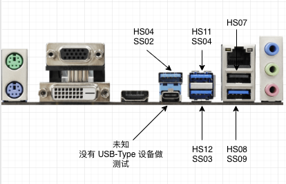
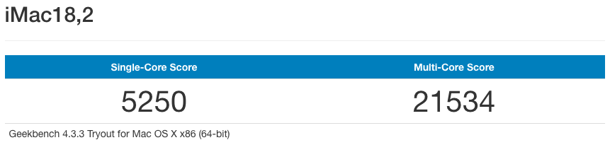
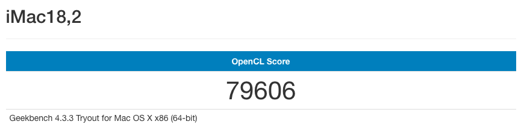
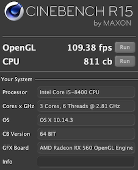

# asrock-z370m-pro4-hackintosh

This repo was made for my hardware specifications only, you can use it as your building guide, don't use it directly.

## Hardware Specifications

CPU: Intel i5 8400

Motherboard: [Asrock Z370M Pro4](https://www.asrock.com/MB/Intel/Z370M%20Pro4/index.asp)

Graphic Card: SAPPHIRE PULSE Radeon™ RX 560 4GD5

Wi-Fi & BT: BCM943602CS

RAM: Micron 8G DDR4 2666 x 4

SSD0: Intel 760P 512G NVMe M.2 (The latest macOS)

SSD1: HP EX900 250G (The latest macOS)

HDD0: Toshiba 1TB HDD (TimeMachine)

Display0: Dell U2718QM

Display1: Dell U2414H

Wi-Fi & BT card are natively supported by macOS, work out of box.

## BIOS Settings

BIOS Version: 3.20

Advanced \ Chipset Configuration → Vt-d : Disabled

Advanced \ Super IO Configuration → Serial Port: Disabled

Advanced \ USB Configuration → XHCI Hand-off : Enabled

Advanced \ Chipset Configuration → Share Memory : 128MB

Advanced \ Chipset Configuration → IGPU Multi-Monitor : Enabled

## UEFI Drivers

| File | Comment | Website/Doc |
|------------------|---------------------------------------------------|---------------------------------------------------------------------------------------------------------|
| ApfsDriverLoader | Open source apfs.efi loader based on reverse-engineered Apple's ApfsJumpStart driver | [AppleSupportPkg](https://github.com/acidanthera/AppleSupportPkg) |
| AptioMemoryFix | Fix Memory problems on UEFI firmware | [AptioFixPkg](https://github.com/acidanthera/AptioFixPkg) |
| FSInject | Driver responsible for Clover's /EFI/kexts/XXX kext injection into kernelcache | [FSInject](https://sourceforge.net/p/cloverefiboot/code/HEAD/tree/FSInject/) |
| SMCHelper | Restore SMC keys left in NVRAM by FakeSMC |  |
| VBoxHfs | Provide HFS+ support | [VBoxHfs.inf](https://sourceforge.net/p/cloverefiboot/code/HEAD/tree/FileSystems/VBoxFsDxe/VBoxHfs.inf) |

## Kext Files

| File | Comment | Website/Doc |
|--------------------------------|---------------------------------------------------------|---------------------------------------------------------------------------------------|
| AppleALC.kext | Native macOS HD audio for not officially supported codecs | [AppleALC](https://github.com/acidanthera/AppleALC) |
| FakeSMC.kext and FakeSMC_*.kext | Allow you to access information from hardware sensors available on your Mac | [os-x-fakesmc-kozlek](https://bitbucket.org/RehabMan/os-x-fakesmc-kozlek/src/master/) |
| IntelMausiEthernet.kext | OS X driver for Intel onboard LAN | [os-x-intel-network](https://bitbucket.org/RehabMan/os-x-intel-network/src/master/) |
| Lilu.kext | Arbitrary kext and process patching on macOS | [Lilu](https://github.com/acidanthera/Lilu) |
| USBPorts.kext | ☠️ My USB configuration file, DO NOT USE IT |  |
| WhateverGreen.kext | Various patches necessary for certain ATI/AMD/Intel/Nvidia GPUs | [WhateverGreen](https://github.com/acidanthera/WhateverGreen) |
| XHCI-unsupported.kext | Certain Intel xHCI controllers are not supported natively and require an injector | [OS-X-USB-Inject-All](https://github.com/RehabMan/OS-X-USB-Inject-All) |

## Installation Caveats

### FileVault

No FileVault, more features mean more uncertainties.

### Energy Saver

Uncheck Power Nap, it wakes your Hackintosh up during sleep.

### Audio

To make audio work, Audio Inject's value must be `1`.

### Use USB 2.0 port to install macOS

macOS USB installer must be inserted into the onboard USB 2.0 port. Otherwise, installation will be failed - [AppleUSBHostPort::disconnect: persistent enumeration failures](https://www.tonymacx86.com/threads/solved-appleusbhostport-disconnect-persistent-enumeration-failures-and-shows-stop-sign.265606/#post-1857030).

### Make USB work properly

Here are some issues you’re going to have if USB doesn't work properly:

1. Unable to detect USB devices.
2. Computer wakes up immediately after sleep.
3. Limit USB 3.0's speed at 480 Mbps.
4. Need replugging USB devices after reboot/sleep.

To make USB and sleep work properly, you need to make a USB patch. macOS 10.14.1 has USB port limit, thus you need an earlier version of macOS, for example, macOS 10.13.6.

⚠️ When I was building this Hackintosh, there was no USB ports limit patch for macOS 10.14.1, thus I had to install an earlier version of macOS. If you can find the patch for your macOS on this page - [List of Hackintosh USB Port Limit Patches (10.14 Updated)](https://hackintosher.com/forums/thread/list-of-hackintosh-usb-port-limit-patches-10-14-updated.467/), lucky for you, you just saved a lot of time!

**1 Remove USB port limit**

After installing macOS 10.13.6 you need to remove USB port limit. Otherwise, you can only see 15 USB ports on FB Patcher. Here is the removal guide - [List of Hackintosh USB Port Limit Patches (10.14 Updated)](https://hackintosher.com/forums/thread/list-of-hackintosh-usb-port-limit-patches-10-14-updated.467/).

**2 Use FB Patcher to generate USB patch**

After the USB port limit removal, reboot your computer and follow this guide to make your USB patch - [USB Port Patching](https://www.tonymacx86.com/threads/release-intel-fb-patcher-v1-6-5.254559/).

**3 Store your USB patch file**

Store your USB patch file in a secure place, it's your patch file, you can't find it anywhere else.

### Intel Framebuffer Patching

To make the integrated Intel UHD 630 work, please follow this tutorial to enable Intel Framebuffer Patching - [Intel Framebuffer patching using WhateverGreen](https://www.insanelymac.com/forum/topic/334899-intel-framebuffer-patching-using-whatevergreen/).

That tutorial is long and boring, for 8th Gen CPU users, just read this - [corpnewt/Hackintosh-Guide](https://github.com/corpnewt/Hackintosh-Guide/blob/master/config.plist-per-hardware/coffee-lake.md#properties).

### Data Protection

For data security, recommend using Time Machine to back up your system.

## What's working

- [x] Sleep and awake
- [x] Multi-monitor support
- [x] Bluetooth, Wi-Fi and ethernet
- [x] iMessage, Handoff, Continuity, FaceTime and AirDrop
- [x] Audio in/out put
- [x] Headless Intel iGPU
- [x] Time Machine

## Known issues

### Bluetooth rarely stops working after sleep.

It happens on real Macs too, in my case, it was caused by my Apple Watch trying to unlock my Hackintosh after sleep, it should be fine if you don't have an Apple Watch.

Reboot bluetooth service with this command: `` $ sudo kill -9 `pgrep bluetoothd` `` - [Restart Bluetooth Daemon on Mac OS X without restarting](https://gist.github.com/nicolasembleton/afc19940da26716f8e90#gistcomment-2636787).

### Kernel panics when running Wireless Diagnostics.

I discovered this issue when I was troubleshooting my home Wi-Fi. I checked the kernel log and can't figure out why, not a big deal, [wireless-diagnostics](./kernel-panics/wireless-diagnostics.log).

## How to upgrade macOS

❗ Backup your system, suggest to use [Carbon Copy Cloner](https://bombich.com/) make a bootable backup, you can boot from your backup and restore the whole system if the update fails.

❗ Use [Kext Updater](https://bitbucket.org/profdrluigi/kextupdater/downloads/) to update kexts and Clover.

❗ Be cautious, check online forums for potential issues before updating.

## System upgrade history

| Version | Date | Comment |
|-------------------------------|-----------|----------|
| macOS Mojave 10.14.2 (18C54)  | 2018.12.7 | Normal upgrade, no issue |
| macOS Mojave 10.14.3 (18D42)  | 2019.1.23 | Normal upgrade, no issue |
| macOS Mojave 10.14.3 (18D109) | 2019.2.11 | Normal upgrade, no issue |
| macOS Mojave 10.14.4 (18E226) | 2019.3.26 | Normal upgrade, no issue |
| macOS Mojave 10.14.5 (18F132) | 2019.5.14 | Normal upgrade, no issue |
| macOS Mojave 10.14.6 (18G84)  | 2019.7.23 | Normal upgrade, no issue |
| macOS Mojave 10.14.6 (18G87)  | 2019.8.6  | Normal upgrade, no issue |

## USB port mapping

HSXX means USB 2.0，SSXX means USB 3.0.

Onboard ports:

Bluetooth: HS05

Case front panle USB (up)：HS09 SS06

Case front panle USB (down)：HS09 SS06

## Benchmarks

### Geekbench CPU

### Geekbench GPU

### Cinebench

